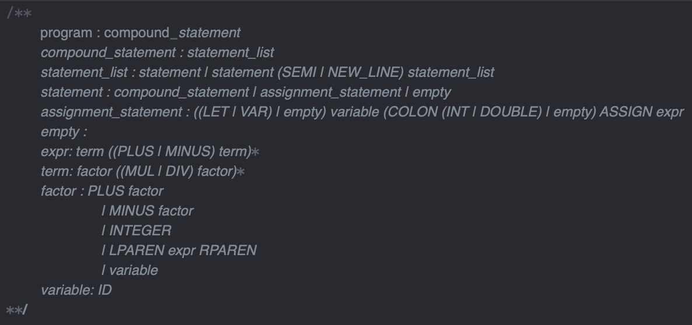

Интерпретатор подмножества языка Swift с рядом условностей:
- Доступны типы Int и Double, константы и переменные, арифметические операции.
- Есть обработка однострочных и многострочных комментариев.
- Есть проверка и выведение типов, но все числа по факту Double.
- Есть объявление функций без возвращаемых значений.
- Пока нет концепции блоков и областей видимости.

Нет поддержки строковых типов данных, ввода вывода, ООП, ФП и тд.

В какой-то момент я немного потерял мотивацию, поэтому в коде не реализованы некоторые абстракции и он сильно связан:
 - Нет концепции символов (переменные и функции хранятся сразу как объекты AST с дополнительными аттрибутами).
 - Нет отдельного шага для семантического анализа, примерно, т.к. нет символов. Часть проверок делается при синтаксическом анализе, часть при интерпретации.
 - Области видимости реализованы на уровне листьев AST, не отдельными сущностями.

TODO:
 - Вызов функций с передачей в них аргументов
 - Стэк вызовов

В пакетах `calc` промежуточные шаги - всякие калькуляторы, parse tree, abstract syntax tree.  
В пакете `interpeter` код интерпретатора для следующей грамматики:

