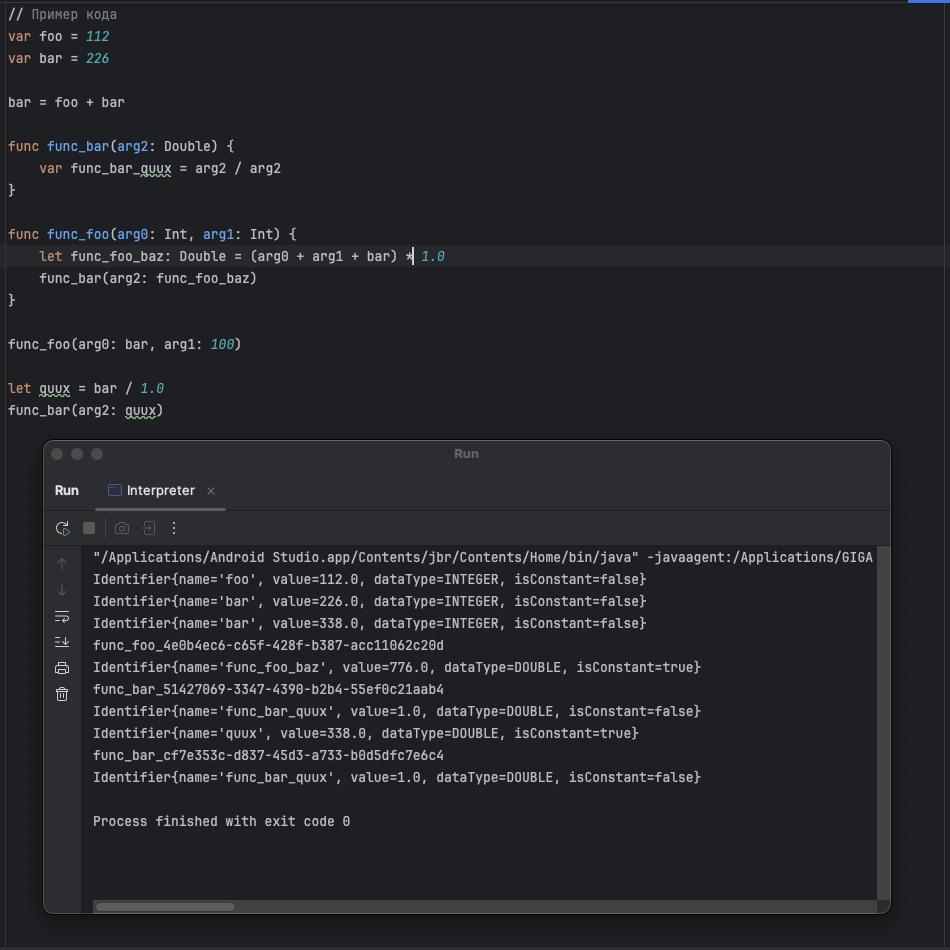

Интерпретатор подмножества языка Swift с рядом условностей:
- Доступны типы Int и Double, константы и переменные, арифметические операции.
- Есть обработка однострочных и многострочных комментариев.
- Есть проверка и выведение типов, но все числа по факту Double.
- Есть объявление функций без возвращаемых значений.

Нет полиморфизма, поддержки строковых типов данных, ввода вывода, ООП, ФП и тд.

В какой-то момент я немного потерял мотивацию, поэтому в коде не реализованы некоторые абстракции и он сильно связан:
 - Тип Int не всегда выводится автоматически. Если он явно не указан, то у переменной будет тип Double. 
 - Нет концепции символов (переменные и функции хранятся сразу как объекты AST с дополнительными аттрибутами).
 - Нет отдельного шага для семантического анализа, примерно, т.к. нет символов. Часть проверок делается при синтаксическом анализе, часть при интерпретации.
 - Вместо стэка вызовов области видимости реализованы с помощью HashMap, где ключ - это имя функции с уникальным UUID. Это решает проблему с внутренними вызовами и рекурсией, но не так оптимально как стэк.
 - Нет условных операторов и, как следствие, выхода из рекурсии)
 - Если переменная объявлена глобально, то нельзя использовать такое же имя в области видимости функции.

В общем, это интересное развлечение

В пакетах `calc` промежуточные шаги - всякие калькуляторы, parse tree, abstract syntax tree.  
В пакете `interpeter` код интерпретатора для следующей грамматики:

